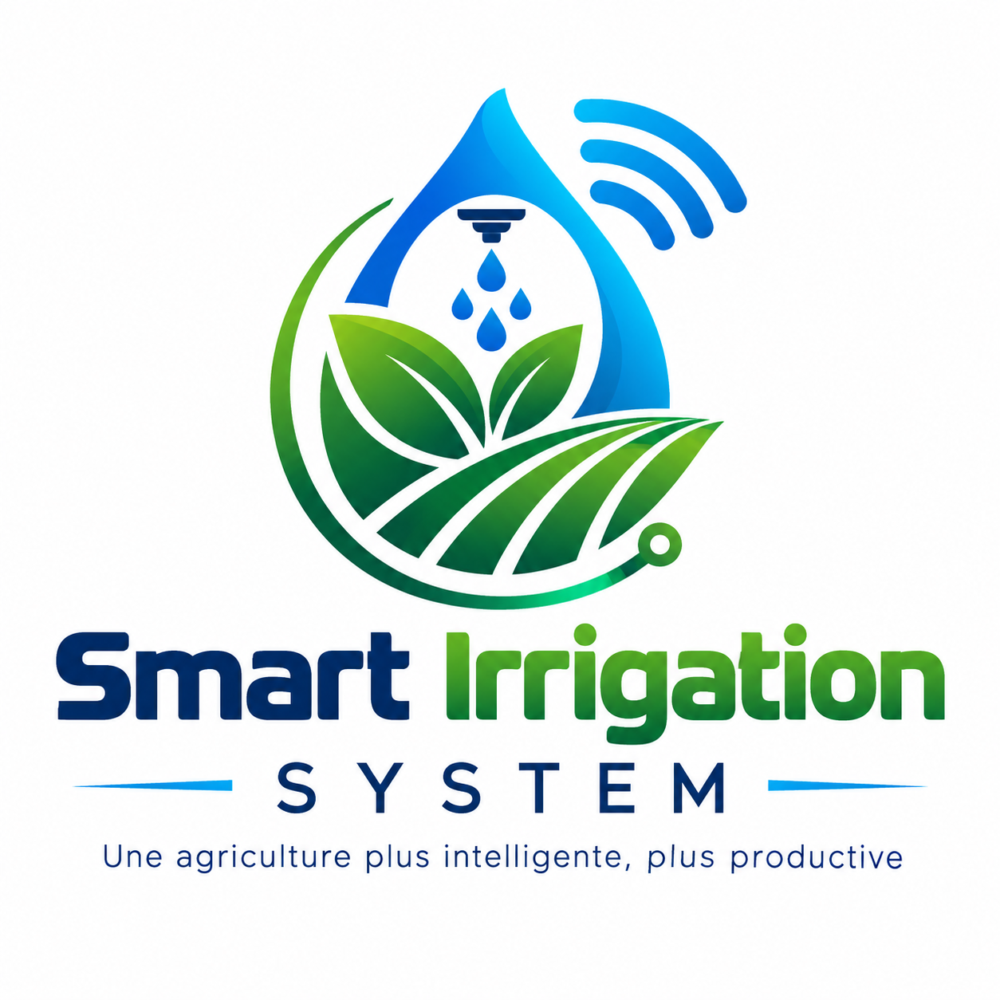

# 🌱 **README — Smart Irrigation System**  
### *Système d’irrigation intelligent basé sur l’IoT, l’automatisation et l’analyse de données*

---

<div align="center">
  
</div>

---

## Présentation du projet

**Smart Irrigation System** est une solution intelligente permettant d’automatiser l’irrigation agricole grâce à des capteurs IoT, une API centralisée, des règles d’irrigation dynamiques et un tableau de bord moderne.

Le système optimise l’utilisation de l’eau, améliore la productivité agricole et permet une gestion intelligente des ressources.

Ce projet fait partie de l’écosystème technologique d’**API Business Technology**.

---

## Objectifs du système

Smart Irrigation permet de :

- Automatiser l’irrigation selon l’humidité du sol, la météo et les règles définies  
- Collecter et analyser les données des capteurs en temps réel  
- Contrôler les pompes à distance via MQTT  
- Réduire la consommation d’eau  
- Améliorer la productivité agricole  
- Offrir une interface moderne pour la supervision complète du système  

---

## Fonctionnalités principales

### Capteurs IoT
- Humidité du sol  
- Température  
- Luminosité  
- Débit d’eau  
- Niveau de réservoir  

### Automatisation intelligente
- Activation/désactivation automatique des pompes  
- Règles d’irrigation personnalisées  
- Gestion des cycles d’arrosage  
- Mode manuel ou automatique  

### Tableau de bord moderne
- Visualisation des capteurs  
- Statistiques d’irrigation  
- Historique des actions  
- Graphiques de consommation d’eau  

### Alertes intelligentes
- Niveau d’eau bas  
- Capteur inactif  
- Débit anormal  
- Pompes hors service  

---

## Architecture globale

```
Smart Irrigation System
│
├── IoT (ESP32 + Capteurs)
│   ├── Humidité du sol
│   ├── Température
│   ├── Luminosité
│   └── Débit d’eau
│
├── Communication (MQTT)
│   ├── Broker
│   └── Topics IoT
│
├── Backend (Node.js / NestJS)
│   ├── API REST
│   ├── Règles d’irrigation
│   ├── Gestion des pompes
│   └── Sécurité & Authentification
│
├── Frontend (Next.js / React)
│   ├── Tableau de bord
│   ├── Capteurs
│   └── Historique
│
└── DevOps
    ├── GitLab CI/CD
    ├── Tests automatisés
    ├── SonarQube
    ├── Stryker
    ├── Monitoring
    └── Infrastructure sécurisée
```

---

## Objectif du Projet

Le projet **Smart Irrigation** vise à optimiser l’utilisation de l’eau dans les exploitations agricoles grâce à l’IoT, l’automatisation et l’analyse intelligente.  
Il permet de réduire la consommation d’eau tout en améliorant la santé des cultures.

---

## Rôle dans l’Écosystème API Business Technology

Ce projet fait partie de la suite **Smart Farm**.  
Il occupe le rôle suivant :

- **Fonction technique :** Backend + IoT + Automatisation  
- **Responsabilité :**  
  - Gestion intelligente de l’irrigation  
  - Analyse des données des sols  
  - Déclenchement automatique de l’arrosage  
  - Intégration avec Smart Farm Animal et Smart Farm Dashboard

---

## Problème résolu

- Surconsommation d’eau  
- Irrigation non contrôlée  
- Absence de données sur l’humidité des sols  
- Manque d’automatisation dans les fermes

---

## Utilisateurs ciblés

- Fermes agricoles  
- Serres intelligentes  
- Coopératives  
- Municipalités (espaces verts)

---

## Intégration avec les autres services

- Smart Farm Animal  
- Smart Farm Dashboard  
- Modules IA internes  
- Services IoT


## Technologies utilisées

### IoT
- ESP32  
- Capteurs analogiques et numériques  
- MQTT  

### Backend
- Node.js  
- NestJS  
- TypeScript  

### Frontend
- React  
- Next.js  
- TailwindCSS  

### DevOps
- GitLab CI/CD  
- SonarQube  
- Stryker Mutation Testing  
- Docker  
- Azure  

---

## Installation & Déploiement

### Backend
```bash
npm install
npm run build
npm start
```

### Frontend
```bash
npm install
npm run dev
```

### IoT
- Configurer les topics MQTT  
- Définir les seuils d’humidité  
- Connecter les capteurs à l’ESP32  

### Déploiement
- Pipeline GitLab CI/CD  
- Environnements : dev → staging → production  
- Déploiement sécurisé via Azure  

---

## Documentation API (aperçu)

### Capteurs
- `GET /sensors`  
- `POST /sensors/update`  

### Pompes
- `POST /pump/on`  
- `POST /pump/off`  
- `GET /pump/status`  

### Règles d’irrigation
- `GET /rules`  
- `POST /rules/create`  

### Historique
- `GET /history`  

---
## Documentation Fonctionnelle / API

Cette section présente les fonctionnalités principales du projet ainsi que la structure générale de son API.

---

### Endpoints principaux

| Méthode | Endpoint | Description |
|--------|----------|-------------|
| GET    | /resource | Récupération des données principales |
| POST   | /resource | Création d’une nouvelle ressource |
| PUT    | /resource/:id | Mise à jour d’une ressource existante |
| DELETE | /resource/:id | Suppression d’une ressource |

> Remplacer **resource** par le nom réel selon le projet  
> (ex : `/animals`, `/stocks`, `/alerts`, `/users`, etc.)

---

### Paramètres importants

- **id** : Identifiant unique de la ressource  
- **token** : Jeton d’authentification (JWT)  
- **animalId / stockId / userId** : Identifiants spécifiques selon le projet  
- **limit / page** : Paramètres de pagination  
- **filter** : Filtrage des données  

---

### Réponses de l’API

- **200 – Succès**  
  La requête a été traitée correctement.

- **201 – Créé**  
  Une nouvelle ressource a été ajoutée.

- **400 – Erreur de validation**  
  Paramètres manquants ou invalides.

- **401 – Non authentifié**  
  Jeton invalide ou absent.

- **403 – Non autorisé**  
  L’utilisateur n’a pas les permissions nécessaires.

- **404 – Introuvable**  
  Ressource inexistante.

- **500 – Erreur serveur**  
  Problème interne du système.

---

### Sécurité

- **JWT** pour l’authentification  
- **RBAC** (Role-Based Access Control) pour la gestion des permissions  
- **Chiffrement** des données sensibles  
- **Audit logs** pour tracer les actions importantes  
- **Validation stricte** des entrées utilisateur  

---

### Modules / Fonctionnalités principales

- Fonctionnalité 1 : [Décrire la fonction principale du projet]  
- Fonctionnalité 2 : [Décrire une fonction secondaire]  
- Fonctionnalité 3 : [Décrire une interaction avec un autre service]  

> Remplacer ces lignes par les vraies fonctionnalités selon le repo.

---

### Intégration dans l’écosystème API Business Technology

Ce projet fait partie de l’écosystème global et interagit avec :

- [Nom du produit principal]  
- [Backend / Frontend / DevOps / IA / IoT]  
- [Autres services liés]  

---
## Sécurité & Confidentialité

Le module **Smart Irrigation** gère des données provenant de capteurs IoT liés à l’humidité du sol, à la météo et aux systèmes d’arrosage.  
La sécurité est essentielle pour garantir la fiabilité du système et la protection des infrastructures agricoles.

### Principes de sécurité appliqués
- Chiffrement des communications IoT (TLS, MQTT sécurisé)
- Authentification par jetons (JWT)
- Gestion des permissions (RBAC) pour les exploitants agricoles
- Validation stricte des données des capteurs (humidité, température, pression)
- Protection contre les attaques API (injections, brute force, replay)
- Journalisation des actions critiques (activation/désactivation de l’arrosage)

### Confidentialité
- Aucune donnée personnelle n’est stockée dans ce dépôt
- Les identifiants des capteurs sont masqués dans les environnements de test
- Les systèmes réels respectent les normes canadiennes de protection des données agricoles

Smart Irrigation garantit une gestion sécurisée et conforme des données IoT liées à l’arrosage intelligent.
```

---

## Installation & Déploiement (Modèle)

Ce dépôt représente le backend IoT du système **Smart Irrigation**, responsable de la gestion intelligente de l’eau.

### Prérequis
- Node.js ou Python (selon l’implémentation réelle)
- Git
- Accès à un broker MQTT ou API IoT
- Variables d’environnement pour les capteurs et les modules météo

### Installation (modèle)
```bash
git clone https://gitlab.com/api-business-technology/smart-irrigation-backend
cd smart-irrigation-backend
```

### Déploiement (modèle)
- Configuration des capteurs d’humidité du sol
- Intégration avec les modules météo (API)
- Déploiement sur un serveur cloud
- Activation des modules IA pour la prédiction d’arrosage
- Connexion avec Smart Farm Dashboard

Ce guide représente la structure générale du déploiement réel.
```

---

```md
## Roadmap (Modèle)

### Q1 — Fondation
- Architecture IoT
- Structure du backend
- Documentation API

### Q2 — Automatisation intelligente
- Déclenchement automatique de l’arrosage
- Analyse des données du sol
- Intégration météo

### Q3 — Optimisation
- Réduction de la consommation d’eau
- Sécurité renforcée
- Tests IoT avancés

### Q4 — Scalabilité
- Support de milliers de capteurs
- Optimisation cloud
- Intégration complète Smart Farm

### Vision 2027
- IA prédictive pour l’arrosage intelligent
- Automatisation avancée des exploitations agricoles

### Vision 2030
- Plateforme agricole intelligente unifiée
- Gestion autonome de l’irrigation
```
---

## Testing & Quality (Modèle)

Ce dépôt inclut une structure de tests permettant de garantir la qualité du code et la stabilité du système.

### Types de tests
- Tests unitaires (Jest / Pytest)
- Tests d’intégration
- Tests UI (Cypress pour les frontends)
- Tests de performance (modèle)
- Tests de sécurité (modèle)

### Qualité du code
- Linting automatique (ESLint / Flake8)
- Formatage automatique (Prettier / Black)
- Analyse statique (modèle)

### Couverture de tests
Un rapport de couverture sera généré automatiquement via CI/CD.

### Objectif
Assurer un code stable, maintenable et conforme aux standards professionnels.
```

---

## CI/CD Pipeline (Modèle)

Ce dépôt inclut un pipeline CI/CD permettant d’automatiser les étapes de build, test et déploiement.

### Étapes du pipeline
- Build du projet
- Exécution des tests
- Analyse de qualité
- Génération des artefacts
- Déploiement automatique (modèle)

### Environnements
- Développement
- Staging
- Production

### Sécurité CI/CD
- Variables protégées
- Gestion des secrets
- Permissions d’accès aux pipelines

### Objectif
Automatiser le cycle de développement pour garantir rapidité, fiabilité et qualité.
```

## AI & Data (Modèle)

Ce dépôt inclut une structure dédiée aux modules IA et aux données utilisées pour l’entraînement.

### Structure des données
- Datasets bruts
- Datasets prétraités
- Labels / annotations
- Scripts de prétraitement

### Modèles IA
- Modèles de classification (modèle)
- Modèles de détection (modèle)
- Modèles de prédiction (modèle)

### Pipeline IA
- Prétraitement des données
- Entraînement du modèle
- Évaluation
- Export du modèle

### Objectif
Fournir une base solide pour l’intégration de l’intelligence artificielle dans le système.
```
---


## Licence

Ce projet est **UNLICENSED**.  
Aucune permission n’est accordée pour utiliser, copier, modifier ou distribuer ce logiciel sans autorisation explicite du propriétaire.

Tous droits réservés.  
© API Business Technology – Projet Smart Irrigation System

---


##Contact

**Fondateur & CEO : Pierre Richard Saint Louis**  
API Business Technology  
Gatineau,Ottawa, Canada 
apibusinesstechnology@gmail.com
apibusinesstechnology@outlook.com
www.apibusinesstechnology.com 


## Auteur

**Pierre Richard Saint Louis**  
Diplômé en **Programmation informatique (DEC)** — Collège La Cité  
Titulaire d’un **Baccalauréat en Finance**  
Fondateur de **API Business Technology**

Professionnel passionné par l’ingénierie logicielle, le DevOps, la qualité logicielle, la sécurité applicative et l’architecture de systèmes.  
Pierre combine une expertise technique solide avec une vision analytique issue de la finance, lui permettant de concevoir des solutions robustes, performantes et adaptées aux besoins opérationnels des entreprises.

# **Pensée du CEO**
Si, dans ton parcours de vie, rien ne semble indiquer la réussite, ne te décourage pas. Continue de croire en une force plus grande que toi et travaille sans relâche pour construire le succès que tu désires. La réussite n’apparaît pas toujours au début, mais elle finit toujours par se manifester là où la discipline et la détermination persistent, même lorsque l’espoir devient fragile.

Saint Louis Piuerre Richard, CEO of API Business Technology


---